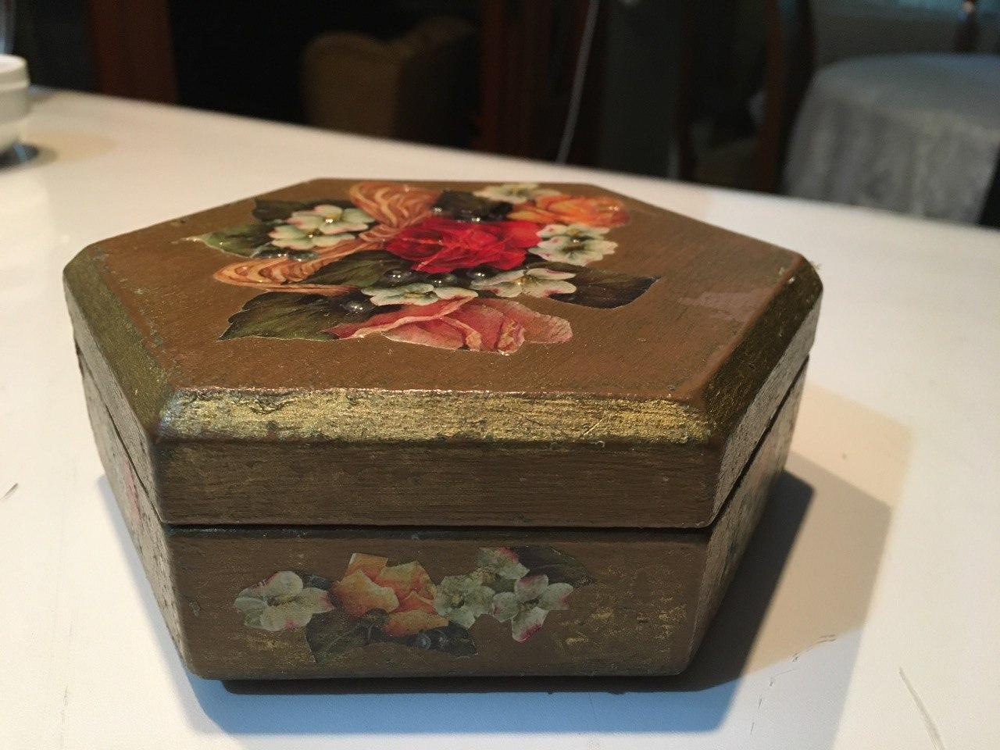
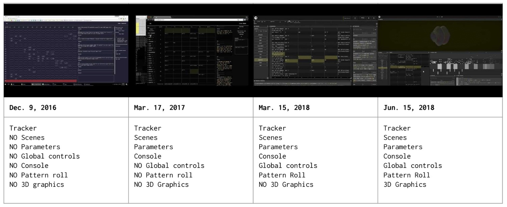

# Reading Reflection: January 21st

<!-- 
- McCullough, M. 1998. Abstracting Craft: The Practiced Digital Hand. Chapter 7: Medium, MIT Press.

- Ingold, Tim. (2010). The textility of making. Cambridge Journal of Economics. 34. 91-102.

#### Prompt
Select an example of a favorite medium or material you’ve used at some point in your life. In line with the ideas of affordance and/or textility, describe the creative processes imposed by your selected medium. Bring an example of the medium to class on Tuesday (photograph, physical sample, etc.)
-->

When I was in primary school, I was taking classes that teach the physical craft. I worked with papers, wood, metal, glass, etc., and I distinctly liked working with each medium. I remember the time I enjoyed decorative wood painting the most (Figure 1). The base paint, decorative paint, and varnish are all provided affordances engrained in the material itself. Wood also defined some limitations on what I can do to the final product. Just like McCullough explains, the combination of these affordances and constraints has shaped my expression using the medium. I wouldn't claim that I am a skilled decorative wood painter whatsoever, but even in the early ages of my life, the textility of the medium helped me to find a process that would ultimately lead a finished product. Just like Ingold argues, it worked as my sawing planks and led to experimentation. 

On the contrary, I have been working with software tools in my adult life. Comparison between wood painting and programming is quite hard, one is not as immediately responsive as the other. "The data structures underlying dense notation become a source of affordance and constraint. Like understanding the affordances of physical materials, choosing a digital medium that best suits your purposes [... choosing the right framework and language in the case of software development...] has emerged as an important component of software expertise." When I look at the process of developing a piece of software for creative purposes, I realize that I always start with a preconceived idea and a structure but actually change them as I develop the features that require it. The *itineration* becomes prominent (Figure 2). In this sense, as McCullough puts it, "the challenge [with] designing abstract systems of expressive capability is not the limitation of the systems themselves, [but] of dealing with abstract structure. [It] is to develop abstract descriptions of sufficient richness, capable of capturing profound emotions and subtle expressive nuances." 

<!--
## Abstracting Craft: The Practiced Digital Hand. Chapter 7

Medium: class of tools and raw materials

Where a tool is an effector or a probe, a medium is a substance that may be sensed or altered somehow by tools

the basis of an abstract medium

### Engagement, Affordance, Constraint
- Engagement -- Density 
	- contuniety: (must have lots of possibilities), we must be able to flow from one state to another continuously
	- variety :  countless subtle differentiations of conditions yields satisfactory practice

- A rich medium offers lots of paths that no one practitioner can explore all possibilities.
always a medium whose intrinsic advantages are appropriate to the task at hand

- Affordance -- workable properties of a medium (what a medium can do?)
	- tolerances : properties and limitations of that medium
	- a medium is found, and its affordances are discovered.

- Constraint -- limits of a medium.
	- they define formal possibilities and guide creativity into specific channels, much like banks define a river. ; a source of strength
	- the rigor of the substance
	
- Together, affordances and constraints shape expression
- engineers, designers, craftspeople understands contraints and affordances. 
	- engineers optimize and find ways to automate and augment human conditions
	- artists are not interested in optimization, yet seeks pure expression. they are concerned with intellectual context (aesthetic theory)
	 
- But between these modes there remains some realm where scientific production cannot go, where mechanized industry finds too little demand to go, and where artistic discourse cares not to go. Where personal knowledge still combines with practical intent, where the expression is as much functional economy as aesthetic stance, where the products are individual and idiomatic, where the medium is the basis for mastery: there we find **craft**.

- worksmanship is a property of the process or a worker, than of the medium itself. 

- Thorstein Veblen claims that craftsmanship retain control of the process, even in tech setting. 
- David Pye talks about "good material" : paying tribute to traditions of worksmanship. good materials are made by years of committed work.
- Pye talks about workmanship of certainty as the basis of manufacturing. 

### Appreciation
- An artifact's expressiveness is shaped by the properties of medium.

- Gombrich summarizes that the form of art is not exactly as the artist had imagined, or he had observed in outside world. It is a rendering within an *acquired* medium, through tradition and skill of both the artist and the beholder. (emphasis on acquisition of a medium, skills of artist and interpretation of audience)

- art needs to operate on a higher level than purely sensory. its reception must engage subjective frameworks of audience. "the illusion of looking into the invisible realms of the mind"

- *latent content* : as expression neither intended by the author nor read in by the recipient, but conveyed by the cultural context under which the artifact has been produced and received

- Appreciation requires exposure to a lot of pieces. Intentional appreciation has close relation to craft, the music piece you listened in between two listenings of a concert may affect your appreciation of the second time. 

- we cannot ask a work of art what it is for. Art appreciation generally ran away from the machine, until industrial age became mature. 

- One might overgeneralize that if traditional appreciation was *within* a medium, then modern appreciation became more likely to be *of* a medium.

- MODERN ART, from Motherwell to Monk, is not **about**, it simply **is**. Susan Sontag: modernism shook off the yoke of interpretation by using the twin tactics of abandoning representation (as in abstact expressionism), or resorting to literal representation of banal, nonsymbolic objects (as in pop).

- Appreciation has not lost ; art filled some of the void left by religion. *Religion art imparts a sort of eternity to itself. Museums are its temples, critics are theologians ; modern religion of art however circles back upon itself without finding the path to salvation: it keeps questioning the negation of meaning for the sake of the object, and the negation of the meaning for the sake of meaning.*

### The Electronic Medium
- Meanwhile, any fissures between art, craft, and industry have by now been completely overshadowed by the popular culture of electronic communications. Not only does an electronic medium such as film, television, or recorded music allow an easier emphasis on form, with cheaply produced and reproduced content, but also it comes comparatively free from cultural baggage. In the 1960s, Sontag asserted that film had become the most important medium, because there ''It is possible to elude the interpreters in another way, by making works of art whose surface is so unified and clean, whose momentum is so rapid, whose address is so direct that the work can be . .. just what it is.

- "The medium is the Message" (Marshall McLuhan). "The message of any medium or technology is the change of scale or pace or pattern that it introduces into human affairs"

- aesthetic production from the work of a fairly cloistered few into the play of the increasingly networked many.

- The medium is not the message in a digital world. It is an embodiment of it. A message might have several embodiments automatically deliverable from the same data

### The Abstract Medium: Engaging Notational Density

- Writing, is very much shaped by its artifacts, which are sentences and paragraphs. 

- craft in nonmaterial medium, such as poetry, has a very different meaning than the work craft applied to a physical medium.

- Pye's conception of worksmanship includes challanges from tradition to the proposition of electronic craft: is undo and save as killing the risk and irreversbility of great works that demand rigor and deveotion? 

- materiality is pivotal to the question of craft in the electronic realm. 

- 4 basic ideas for unifying particularities of notation and continuously workable medium.
	- bits vs atoms: reversibility vs permanance
	- In elect. media, format is determined after content: Once in digital format, the media become to some degree translatable into one another, the basis of the content boils down to *information*
	- Increased notational density supports quasi-continuous operations formerly only available from physical materials : enough resolution for pixels or samples of audio to fool the eye/ear
	- human-computer interfaces, based on dense notations, provide increasing engagement in structural manipulations : unifying the hand and intellect
	
### Computer as Medium

- Computers constructs the experience of a medium 

- Dimensionality of the artifacts : One dimensional (text or sounds), two-dimensional (pixels), threedimensional (3d graphics), n dimensional (time based operations, animations, etc.) ;; each allows translations between them.

- computers introduces notations (sculpture and solid modeling)

- The data structures underlying dense notation become a source of *affordance and constraint*. Like understanding the affordances of physical materials, choosing the digital medium that best suits your purposes has emerged as an important component of software expertise

- psychological dimensions of human-computer interaction determine the degree of *engagement* with these symbolic manipulation worlds. Thus the nature of the computer as a medium began with the introduction of direct manipulation

- engagement depends on building adequate mental models. Desktops, studios, sequencers, and stages all are representational contexts for specific classes of actions

- Brenda Laurel talks about our willingly suspension of knowledge that a play is "pretend" : Suspending disbelief is an act of participation. We do this to the computer, we pretend that the monitor is our stage. Once we suspend our disbelief, we should be able to work with those assumptions and not suffer being dropped out by anomalies. 

- the challenge in designing abstract systems of expressive capability is not a limitation of the systems themselvesof dealing with abstract structure. Rather, the challenge is to develop abstract descriptions of sufficient richness, capable of capturing profound emotions and subtle expressive nuances

## Ingold, Tim. (2010). The textility of making. Cambridge Journal of Economics. 34. 91-102.

### The hylomorphic model

- Paul Klee : process is more important than final product

- Important thing is not material and forms but materials and forces

- Aristotle : creation relies on bringing form(morphe) and matter(hyle) together (hylomorphic model). Ingold's aim is to counter this : processes of formation against the final products. Timber example, woodsman hits the wood with axe and wood itself determines where the axe will lead.

- textility of making vs. hylomorphic model 

### Following Materials

- technical vs. textilic 
	- technical : system of operational principles, technology
	- textilic  : mere craft, 'feel' of a world engineered in the light of reason
	
- Matisse Enzer (a builder) talks about architects approach to a building as 'complete', however builders approach is a sequence.  Brand : "The idea is crystalline, the fact fluid".

- Siza talks about a house is always a work in progress, inhabitants constantly evolve it. gardener fights with the overgrowth. Deleuxe and Guattari "it is the matter in movement, in flux, in variation". "matter-flow", and Ingold calls this the 'material'. "following the materials".

- builder, gardener, cook, alchemist, painter do not impose form on the matter, they combine materials in anticipation of what might emerge. 

- objects and subjects are interchangable. 

### flying kites

- problem of agency, an attempt to re-animate a world already rendered lifeless by a focus on the 'objectness' of things. 

- generative currents of life : kite that stood lifeless indoors flies freely outdoors with the help of wind

- flyer and kite should be understood not as interacting entities, alternately playing agent to the other as patient, but as trajectories of movement, responding to one another in counterpoint, alternately as melody and refrain

- Daniel Miller claims studying 'what people do with objects' we can understand how they create a world of practice. but brick, soil, flour, paints are not objects, they are materials. People follow the materials, weaving their own lines of becoming into the texture of material flows comsprising the lifeworld. Then buildings pies and paintings emerge out of this 'weaving'.

- the life of things != agency of objects : its a double reduction, thigns to objects and life to agency. hylomorphic model causes this.

### sawing planks

- reversing hylomorphic model, things to life, form-giving.

- backwards reading of creativity, starting from the product and deduce the initial ideas of creator, is 'abduction of agency' (Alfred Gell)

- Ingold insists that a work of art is not an object but a thing, and artist is not there to give effect to a preconceived idea, but to follow the forces of the material that bring the form into being. 

- creation is not necessarily iteration, but of itineration. artist is itinerant wayfarer. i.e. forward movement of the work. it focuses of improvisation. following the ways of the world, of the material. 

- sawing planks can seem as a repetitive execution of opertaional sequence, but for the carpenter its engaging in a continuous varition of variables. no two strokes are identical

- Iteration is metronomic, itineration rhythmic.

### drawing lines

- painting is about time, it is about becoming rather than being. the painter just like the carpenter continuously adjusts where the painting is going. continuous correction. There is no end point, noone can say when a painting is finished. 

- lines on paper loops back to the mind of the drawer, which leads more lines on the paper. 

--> 

